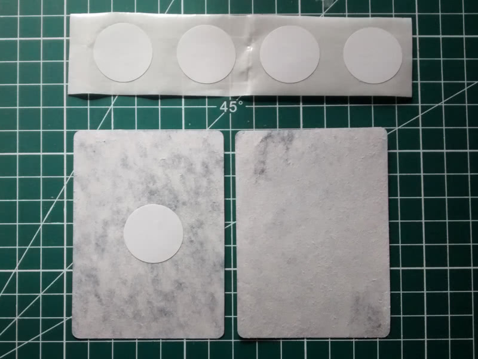
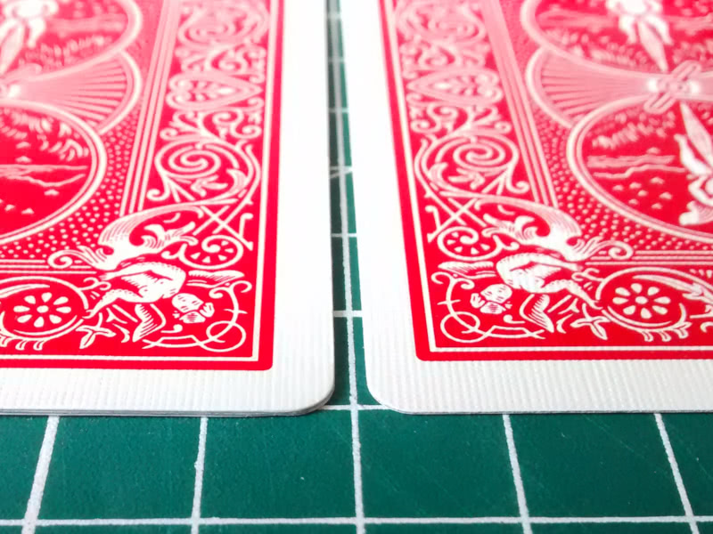

# rfid-playing-cards

PoC project, currently no public files.

The idea behind this project is to build a small device able to read gimmicked (stuffed with a MIFARE Ultralight RFID tag) playing cards, as a tool for magic tricks purpose.

Gimmicked card craft :

Even tought I rushed to build the gimmicked card, the difference between the gimmicked card (left) and a normal card (right) in nearly unnoticeable to the untrained eye :

The suit and value of the card is stored in the RFID tag, using just one byte :
- 4 bits for the value, zero being the jocker
- 2 bits for the suit (CHaSeD order : zero -> Club, one -> Heart, etc.)

First results are quite positive, the playing card can be scanned without any problem with more than 1.5 cm of wood between the MFRC522 RFID tag reader and the card, giving plenty of room to hide everything in a fake bottom.
