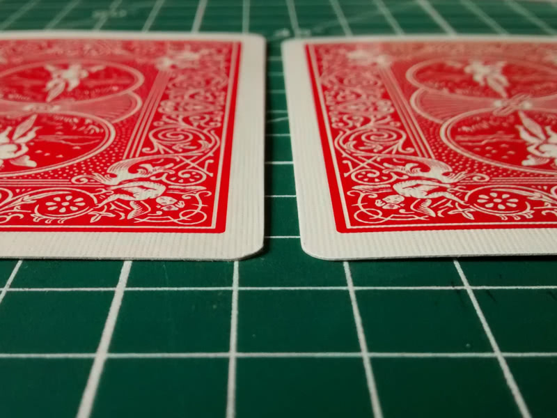

# rfid-playing-cards

## Presentation

PoC project, currently no public files.

The idea behind this project is to build a small device able to read gimmicked (stuffed with a MIFARE Ultralight RFID tag) playing cards, as a tool for magic tricks purpose.

Gimmicked card craft :

Even tought I rushed to build the gimmicked card, the difference between the gimmicked card (left) and a normal card (right) in nearly unnoticeable to the untrained eye :

Gimmicked cards in action :

<figure class="video_container">
  <video controls="true" allowfullscreen="true" poster="rfid_playing_card_live_small.jpg">
    <source src="rfid_playing_card_live_small.mp4" type="video/mp4">
  </video>
</figure>

ESP8266 LoLin DevKit pinout:

| MFRC522 |   ESP8266   |
|:-------:|:-----------:|
|   SDA   |  D4 (GPIO2) |
|   SCK   | D5 (GPIO14) |
|   MOSI  | D7 (GPIO13) |
|   MISO  | D6 (GPIO12) |
|  RESET  |  D3 (GPIO0) |

`auto mfrc522 = MFRC522 {2, 0};`

ESP32 WROOM DevKit pinout:

| MFRC522 | ESP32 |
|:-------:|:-----:|
|   SDA   |  IO5  |
|   SCK   | IO18  |
|   MOSI  | IO19  |
|   MISO  | IO23  |
|  RESET  | IO17  |

`auto mfrc522 = MFRC522 {5, 17};`

The suit and value of the card is stored in the RFID tag, using just one byte (first byte of first data page) :

- 4 bits for the value, zero being the jocker
- 2 bits for the suit (CHaSeD order : zero for clubs, one for hearts, etc.)

As an example, the four of hearts is stored as 20 (14 in hexadecimal).

My first results are quite promising, the playing card can be scanned without any problem with more than 1.5 cm of wood inserted between the MFRC522 RFID tag reader and the card, giving plenty of room to hide everything in a fake bottom.

## Next steps

- Currently, the card scan is sent thru HTTP because it is quite easy, but it is definitively not convenient and I plan to move to Bluetooth.
- Build the actual device ;-)
- Results are actually sent to a smartphone, a dedicated "magical" revelation device would be nice. 
